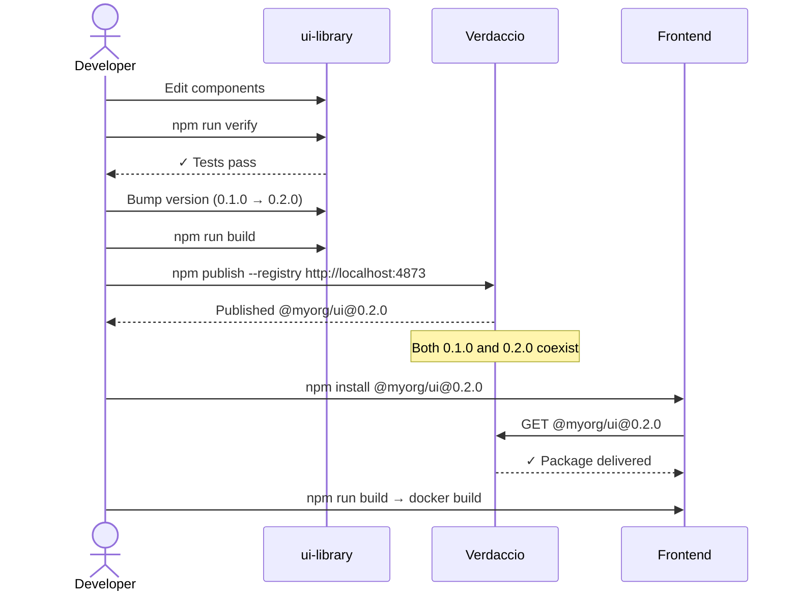
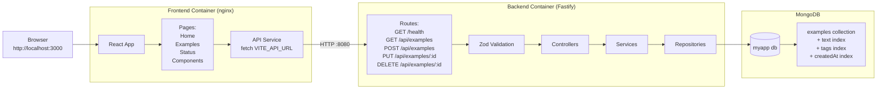
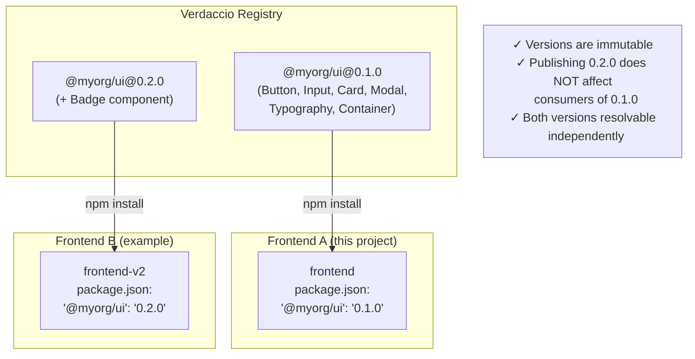
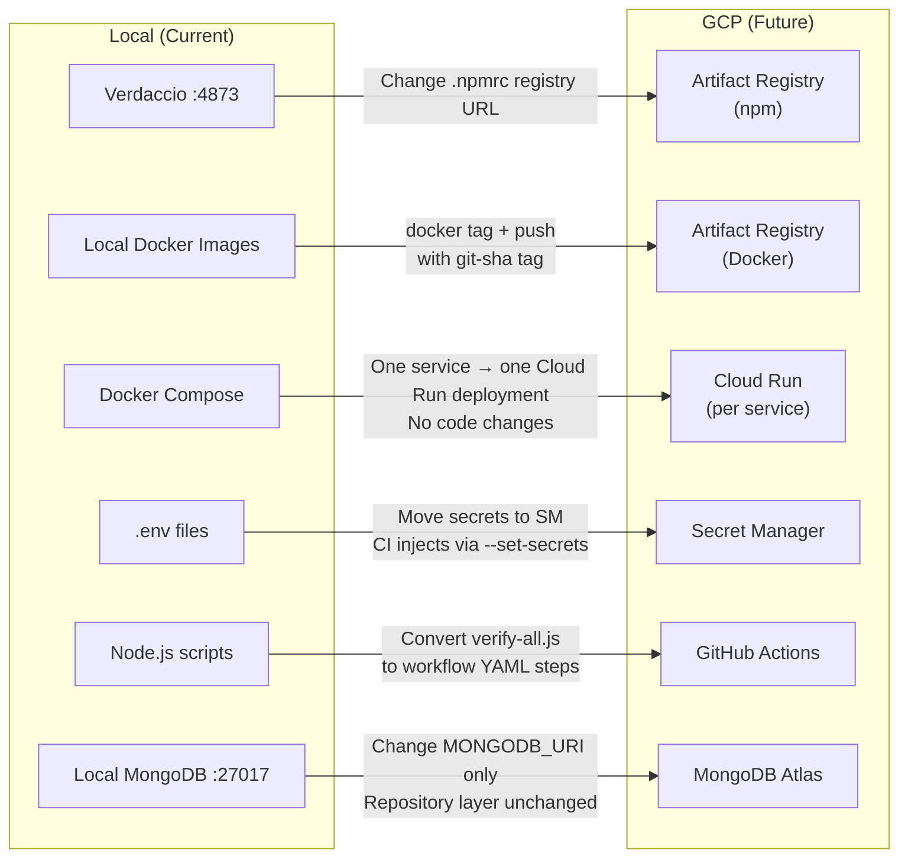
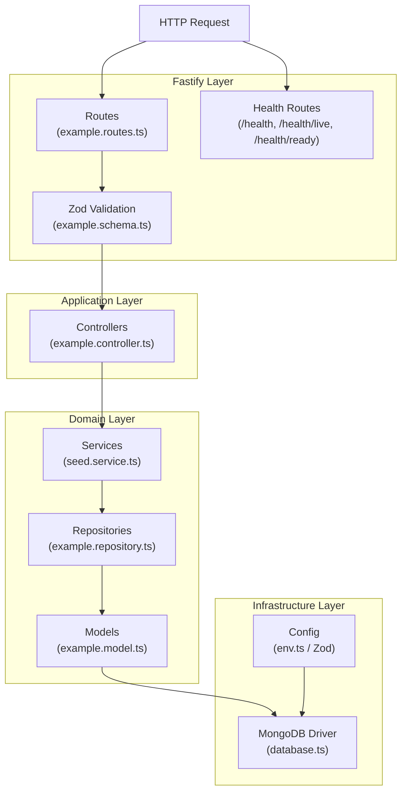
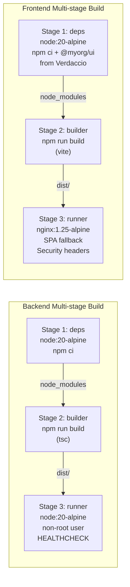

# MyPlatform — Architecture Documentation

## System Architecture

```mermaid
graph TB
    subgraph "Developer Machine"
        DEV[Developer]
        UL[ui-library<br/>@myorg/ui]
        FE[frontend<br/>React+Vite]
        BE[backend<br/>Fastify]
    end

    subgraph "Docker Compose Network"
        VD[Verdaccio<br/>:4873]
        FEC[frontend container<br/>nginx :3000]
        BEC[backend container<br/>Fastify :8080]
        MDB[MongoDB<br/>:27017]
        MEX[mongo-express<br/>:8081]
    end

    subgraph "Persistent Storage"
        VOL1[(verdaccio_storage)]
        VOL2[(mongodb_data)]
    end

    DEV -->|develops| UL
    UL -->|npm publish| VD
    VD --> VOL1

    VD -->|npm install @myorg/ui| FE
    FE -->|docker build| FEC

    BE -->|docker build| BEC
    BEC -->|queries| MDB
    MDB --> VOL2

    FEC -.->|API calls :8080| BEC
    MEX -.->|inspects| MDB

    DEV -->|http://localhost:3000| FEC
    DEV -->|http://localhost:8080| BEC
    DEV -->|http://localhost:4873| VD
    DEV -->|http://localhost:8081| MEX
```

---

## Package Publishing Flow



---

## Frontend / Backend / Database Flow



---

## Version Isolation Architecture



---

## Local to GCP Migration Map



---

## Layered Backend Architecture



---

## Container Architecture


